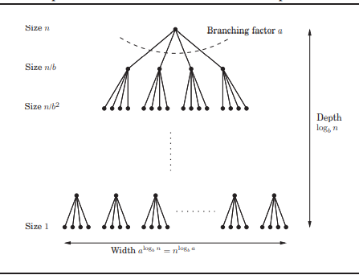

#  Divide and conquer 

## General Strategy

1. Divide the problem if size **n** into some **a** number of subproblems. Each subproblem of size some **n/b**
2.  Find relation between solution solution of problem and solution of **a** subproblems
3. Recursively solve the subproblems.
4. Get the solution of problem from the solution  of sub problems

## General method to find time complexity(Master theorem)

Finding the time complexity of Divide and conquer algorithms is hard to find by just looking at them. Because at each level of recursion the size of gets smaller and the number of sub-problems increases.

Considering this we would have 3 cases

1. Rate of increase in subproblem is less significant then rate of decrease in size
2.  Rate of increase in subproblem and rate of decrease in size are equally significant
3. Rate of increase in subproblem is more significant then rate of decrease in size

To analyze this ,

We use master theorem to find time the time complexity of Divide and Conquer algos

**General Recurrence relation**
$$
T(n) = aT(n/b) + O(n^d), \ \ \ where \ \ a>0, b>1, d\ge1
$$
**Master Theorem**: For the above recurrence relation.
$$
T(n) = \begin{cases} O(n^d) & \ if \ d > \log_b a \\ O(n^d \log_bn) & \ if \  d = \log_b a \\ O(n^{\log_b a}) & \ if \  d <\log_b a \end{cases}
$$

**Proof**

**Three Cases**

1. The ratio is less than 1: The series is decreasing,  its sum is just given by its first term(Most Dominant), $O(n^d)$
2. The ratio is greater than 1 :The series is increasing, its sum is just given by its last term(Most Dominant),  $O(n^d \cdot (\frac{a}{b^d})^{\log_bn})$ which simplifies to $O(n^{\log_b a})$
3. The ratio is =1 : In this case all $\log_b(n)$ levels has $O(n^d)$ work, which gives  $O(n^d \log_bn)$​
