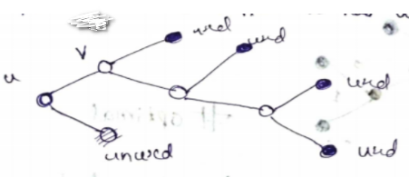
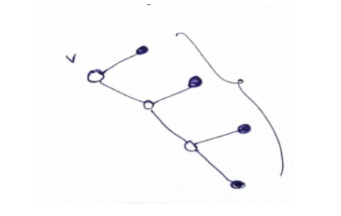
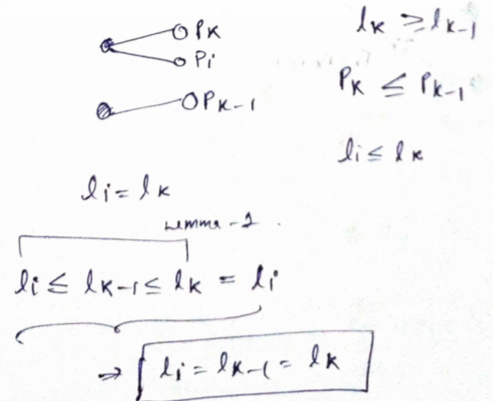

# Huffman Algorithm

Huffman Coding is a data compression technique that reduces the size of data without sacrificing any of the information.It was created by David Huffman

## Problem

`Input ` : A very long string (over some alphabet)

`Output` : Smallest possible unique Binary string (uniquely decodable).

## Basic Idea & Prerequisits

Basic idea will be to give small length codes to the symbols having high frequency and larger length codes to low frequency symbols reducing the average.

Obviously any random encoding wont work as there might be some ambiguity while decoding the encoded string.

for eg.

Assume for some random variable $X \in \{A,B,C,D\}$ . Suppose we have the following encoding

| Symbol | Encoding |
| ------ | -------- |
| A      | 0        |
| B      | 1        |
| C      | 10       |
| D      | 11       |

We realize that BA is indistinguashable from C. So, one solution to this problem is the concept of a **prefix-free code**.

**Prefix-Free Code**

 A code c [set of all codewords] is called a P.F code if no codewordsin c is a prefix of another codeword in c. For example: In the above code 0 , 1 , 10 , 11 , the codewords1 is a prefix for 10 and 11. So, this is not a prefix free codes.

Consider the following code: C = {0, 10, 111, 110}. here no codeword is prefix other code hence it is prefix free.

**Property of Prefix-free codes** : We can represent the prefix free codewords as the leaves of a binary tree.

**Codeword at any given leaf** = Path taken from root to that leaf.  At root codeword is empty and  we append "0"  for going left and "1"  for going right.

**From this above discussion we can say our problem now is to find this tree corresponding to optimal prefix free code.**

`Input`: The frequency $f_1,f_2, \cdots, f_n$​ of  n symbols.

`Output`: A tree whose leaves each correspond to a symbol and which minimizes the overall length of encoding.
$$
\text{cost of tree} =  \sum_{i=1}^{n} f_i.l_i
$$
where $l_i$ is length of ith codeword (depth of the $i$​th symbol in tree).

## Algorithm

**Building Optimal Tree** (Greedy algorithm)

1. Compute the frequency of each symbol in the string.
2. These are stored in a priority queue Q
3. Make each unique symbol as a leaf node.
4. Make a z node . Assign the left child of z the minimum frequency node, and the right child of z the second minimum frequency node. Set the z value to the sum of the two minimum frequencies (Greedy Step)
5. Remove these two minimum frequencies from Q and add the sum into the list of frequencies (Optimal substructure)
6. Repeat steps 3 to 5 Until there is only 1 frequency left in priority queue

**Encoding**

Make Hahtable

- Get the codeword at each leaf by traversing from root to that node. At root codeword is empty and  we append "0"  for going left and "1"  for going right.
- Add the codeword to Hashtable correspoding to character at leaf

Encode using HashTable

- For a given input string
- Initialize empty output string.
- For each character in input string  append the codeword correessponding to character from hash table

**Decoding**

1. Start with empty decoded string
2. Start from root and traverse the tree according to encoded string (if next symbol == "0"--> go left else go right)
3. As soon as we reach leaf append the symbol at leaf to decoded string
4. Go back to root again
5. Repeat steps 2 to 4.

## Proof that Huffman works

Prerequisties 3 lemmas

Optimal code(PF) for representing a source $X$ $P_x$ $x \in X, |X|$ with probability distribution $P_1 \ge P_2 \ge P_3 \ge
P_4 \cdots ≥ P_k$ (this is the Px)

**Lemma 1** : $l_1 \le l_2 \le \cdots \le l_k$ where li is the length of codeword given to symbol xi with probability of Pi.

Proof is obvious if this was not the case the we can construct lower average length by just changing whatever was was different from this case.

**Lemma 2: **In the tree of any optimal PF codes, no leaf is unused $\Longleftrightarrow$every leaf is a codeword

**Proof:** Let C be the optimal code. Let us consider the tree corresponding to this. Suppose it has unused leaf.

Now we can transform this to get rid off the unused leaf and contract u-v edges

Length of these have been reduced by 1, within new tree.

Let the code be C0 then AVG(C0 < Avg(C) As the length is been decreased.

The new tree formed is also a prefix-free code whose length is much less than the initial tree, So, this is optimal
code.

**Lemma 3** There is an optimal code C such that the codewords associated to the 2 smallest probabilities
symbols are siblings (share same parent).

**Proof :**If i say code C satisfies this property, then we were done. Now, lets consider a code with codewords of
length $l_{k−1} < l_k$.

Interchange the codeword for the ith and k − 1th symbols and get the new code C0

Note that the Avg(C) = Avg(C0) $\implies$ C is a optimal code.
Now C satisfies Lemma 1 $\implies$ Hence proved.

**Since our construction will satisfy all 3 lemmas hence it is optimal.**

## Time complexity Analysis

n = no. of unique chacter

### Building optimal Tree

We are using priority queuen Data structure

Assuming n to be no. of unique character and we are given their frequencies

* Getting  2 least frequencies  = O(log n) + O(logn)
* Meging them and making new node whoose child are these 2 = O(1)
* Adding this to priority queue = O(log n)

Since each time we perform these 3 operation 1 node is decreased so we will do these n times

**Final time complexity = ** n(O(log n) + O(log n) + O(log n)) = O(3nlogn) = O(nlogn)

If we consider

Counting Frequency = O (input string length)

let l = input string length

Complexity = O(l + nlogn)

### Encoding

Making hastable

it will take O(nlogn)

Encoding using Hashmap

It will take O(string length)

### Decoding

Since we instaneously decodable code(prefix free). We can decode in O(Encoded String length)

